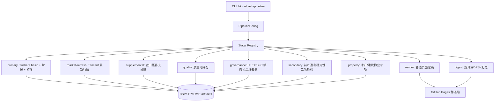

# 港股净现金候选流水线架构

## 当前流程

现有研究流程已经拆成数据、筛选、复核、治理和静态发布几层。重构后的仓库把这些步骤纳入统一 CLI：

```bash
python -m pip install -r requirements.txt
python -m pip install -e .
python -m hk_netcash_pipeline.cli --profile refresh
python -m hk_netcash_pipeline.cli --profile refresh --use-llm
```

密钥只从环境变量读取：

- `TUSHARE_TOKEN`: 供 `tushare.pro_api()` 使用，脚本不写入也不打印。
- `DPSK_API_KEY`: 供可选 DPSK/DeepSeek 汇总使用。
- `DPSK_BASE_URL`: 可选，默认 `https://api.deepseek.com/chat/completions`。

## 架构图



## 设计模式

- Stage/Command: 每个步骤实现统一的 `PipelineStage.run(context)`，CLI 只负责选择和排序。
- Adapter: 现有 `hk_*.py` 脚本通过 `ScriptStage` 适配，不改动核心财务公式。
- Strategy: LLM 汇总层默认用 deterministic 规则策略；传 `--use-llm` 后切换到 `DpskChatClient`。
- Configuration Object: 路径、模型、最大拉取数量、是否补抓缺失财务数据集中在 `PipelineConfig`。
- Artifact Boundary: 所有结果写入 `HK_NETCASH_OUTPUT_DIR`，发布同步只复制白名单产物。

## Stage 顺序

| Stage | 输入 | 输出 | 说明 |
|---|---|---|---|
| `primary` | Tushare HK basic、三表、东方财富行情 | `hk_ranked_candidates.csv` 等 | 全量/半全量初筛，适合冷启动 |
| `market-refresh` | 已有 universe 和财报缓存、腾讯行情 | 刷新后的主榜 | 最近行情价、成交额、市值按价格比例更新 |
| `supplemental` | 合并 universe、财报缓存/可选补抓 | 宽口径候选 | 多抽取一层可能被硬条件漏掉的标的 |
| `quality` | 宽口径或主榜 | 质量候选池 | 盈利、现金流、派息、行业标签再分层 |
| `governance` | 质量池、HKEX/SFC/披露易 | 治理风险覆盖 | 违规、配股摊薄、停牌延迟、profit warning 等 |
| `secondary` | 当前主榜前20、财报缓存、公告标题 | 前20二次检验 | 盈利稳定性、一次性收益、派息透支、现金流覆盖 |
| `property` | 主榜、质量池、治理过滤 | 物业股专项 | 永升服务、建发物业专项判断 |
| `render` | 当前 CSV/MD | `index.html` | 移动端静态页面 |
| `digest` | 汇总产物 | `llm_digest.*` | 规则摘要或 DPSK 摘要 |

## 推荐运行

日常刷新行情和复核：

```bash
python -m pip install -r requirements.txt
python -m pip install -e .
python -m hk_netcash_pipeline.cli --profile refresh
```

需要 DPSK 生成一页摘要：

```bash
export DPSK_API_KEY="..."
python -m hk_netcash_pipeline.cli --profile refresh --use-llm
```

冷启动或财报缓存不足时：

```bash
python -m hk_netcash_pipeline.cli --profile full --pull-missing --max-codes 420
```
